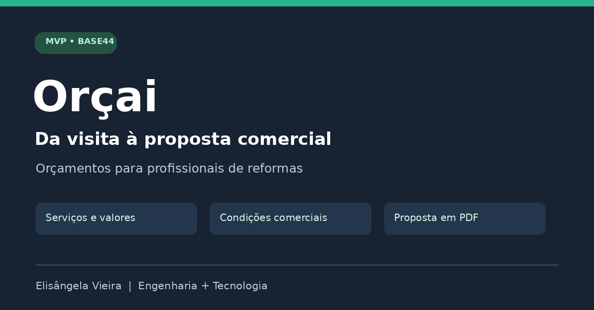

# Orçai — Propostas para reformas

MVP web desenvolvido por **Elisângela Vieira no Base44**, voltado a pequenos construtores e profissionais de reformas que precisam organizar serviços, valores e condições comerciais em uma proposta para o cliente.

**[Acessar o Orçai](https://orcai-fast-quote.base44.app/)** · O acesso requer uma conta.

## O problema

Na visita ao cliente, informações sobre escopo, quantidades, preços e prazos podem ficar dispersas. O Orçai reúne esses dados em um fluxo de orçamento e gera uma proposta em PDF. O benefício pretendido é reduzir retrabalho na preparação da proposta; ainda não há medição de economia de tempo ou validação comercial.

## Recursos da versão demonstrada

- Formulário de cliente e obra, com opções de pessoa física e jurídica.
- Inclusão de serviços com descrição, quantidade, unidade e preço unitário.
- Subtotais e total com campos de impostos e BDI.
- Condições de pagamento, prazo de execução, validade e observações.
- Prévia da proposta durante o preenchimento.
- Salvamento e edição de orçamentos, com propostas recentes na navegação.
- Resumo de valores por status: pendentes, aprovados e concluídos.
- PDF com identificação da empresa, serviços, condições comerciais, campos de assinatura e rodapé de contatos.

A interface também apresenta **Minha empresa**, modelos de serviços, envio de resumo por WhatsApp e conexão Gmail. Esses controles foram vistos, mas seus fluxos completos não foram testados nesta revisão. A integração Gmail não é apresentada como concluída.

## Demonstração e validação

A documentação foi preparada a partir de gravações fornecidas pela autora, um PDF exportado e a tela pública de login em 07/10/2026. Não houve auditoria do código-fonte nem acesso autenticado à aplicação nesta revisão.

O exemplo exportado conferido contém subtotal de R$ 9.000,00, impostos de 11% (R$ 990,00), BDI de 25% (R$ 2.250,00) e total de R$ 12.240,00. Nesse exemplo, ambos os percentuais incidem separadamente sobre o subtotal. Isso não valida todas as combinações de cálculo nem determina percentuais adequados para cada serviço.

Veja [funcionalidades e evidências](docs/FUNCIONALIDADES.md) e [checklist de validação](docs/VALIDACAO.md).

## Como usar

1. Acesse o aplicativo e entre na conta.
2. Confira os dados da empresa em **Minha empresa**.
3. Crie um orçamento e preencha cliente, obra e serviços.
4. Revise valores, impostos, BDI e condições comerciais.
5. Salve e confira a prévia antes de baixar o PDF.
6. Acompanhe os valores das propostas no resumo por status.

As instruções descrevem o fluxo apresentado; ações não demonstradas estão identificadas na documentação.

## Plataforma e escopo deste repositório

A aplicação foi construída no **Base44 com apoio de prompts e IA**. Este repositório contém documentação e materiais de apresentação da versão Base44. **Não contém o código-fonte exportado**, scripts de build, migrations ou instruções de instalação local.

Não são atribuídos frameworks, bibliotecas de PDF ou tecnologias de banco de dados sem acesso ao código. Esta versão é separada de implementações anteriores do Orçai em outras plataformas.

## Limitações atuais

- Marca e domínio Base44 mantidos conforme o plano gratuito utilizado pela autora.
- Requer conexão à internet; funcionamento offline não validado.
- Adicionar um atalho ao celular não comprova instalação PWA, cache offline ou funcionamento nativo.
- Resumo de propostas não equivale a caixa, faturamento recebido ou conciliação financeira.
- Campos de assinatura no PDF não representam assinatura eletrônica validada.
- Gmail, compartilhamento externo, responsividade e isolamento de dados entre contas exigem testes adicionais.

## Evolução

Veja o [roadmap](docs/ROADMAP.md). A comercialização é uma hipótese a validar com profissionais de reformas, sem receita ou adoção comprovada nesta fase.

## Autoria e colaboração

**Elisângela Vieira** — Engenharia Civil, processos e tecnologia aplicada.

Construção da aplicação no Base44; apoio de IA na elaboração de prompts e organização da documentação. Sugestões podem ser registradas nas Issues do repositório quando disponibilizado.

Não foi definida licença de distribuição de software. O repositório não concede permissões de reutilização do código proprietário da plataforma nem de dados de clientes.
